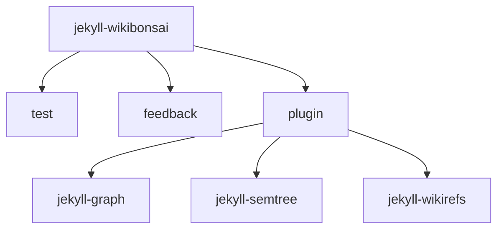

# Jekyll::SemTree

[](https://github.com/wikibonsai/wikibonsai)
[](https://rubygems.org/gems/jekyll-semtree)

⚠️ This is gem is under active development! ⚠️

⚠️ Expect breaking changes and surprises until otherwise noted (likely by v0.1.0 or v1.0.0). ⚠️

Jekyll-SemTree adds the ability to build a (semantic) tree from one of the jekyll collection types (default is `index`). Frontmatter metadata is added to each linked document so that they may be referenced by the relationships in the tree. (For example, on a page it may be desirable to link to all `children` of the current page or to build a breadcrumb trail from the current page's `ancestors`.)

This gem works in conjunction with [`jekyll-graph`](https://github.com/wikibonsai/jekyll-graph).

🌳 Cultivate a "semantic tree" or "knowledge bonsai" in your [🎋 WikiBonsai](https://github.com/wikibonsai/wikibonsai) digital garden.

⚠️ May conflict with [`jekyll-namespaces`](htpps://github.com/manunamz/jekyll-namespaces) -- please only run one with your jekyll blog.

## Installation

Follow the instructions for installing a [jekyll plugin](https://jekyllrb.com/docs/plugins/installation/) for `jekyll-namespaces`.

## Configuration

Defaults look like this:

```yaml
semtree:
  doctype: 'index'
  enabled: true
  page: 'map'
  root: 'i.bonsai'
  virtual_trunk: false
```

`doctype`: Sets the doctype/collection-type for the trunk of the semantic tree.

`enabled`: Toggles the plugin on or off.

`root`: Sets the filename of the root document for the semantic tree.

`page`: Which jekyll page to append tree to. A `nodes` metadata will be padded to that page, which will be accessible via its liquid template. Each node has the form `{ text => string, url => string, ancestors => string[], children => string[] }`.

`virtual_trunk`: Whether or not to include the `index` collection documents in the generation of the semantic tree.

## Usage

The semantic tree is defined by files in the `index` collection. They may include yaml frontmatter and the only content should be a markdown outline of [wikirefs](https://github.com/wikibonsai/wikirefs). Be sure to use the same kind of indentation and indentation size for each level:

```markdown
// i.bonsai.md

---
title: Knowledge Bonsai
---

- [[jekyll-wikibonsai]]
  - [[test]]
  - [[feedback]]
  - [[plugin]]
    - [[jekyll-graph]]
    - [[jekyll-semtree]]
    - [[jekyll-wikirefs]]

// ...
```

Which will create a tree that looks like:



If broken up over multiple index files, it might look something like this:

```markdown
// i.bonsai.md

---
title: Knowledge Bonsai
---

- [[jekyll-wikibonsai]]
  - [[test]]
  - [[feedback]]
  - [[i.plugin]]

// ...

// i.plugin

---
title: Notable Plugins
---

- [[jekyll-graph]]
- [[jekyll-semtree]]
- [[jekyll-wikirefs]]

```

Which will create a tree that looks like:


### Metadata

`ancestors`: This is appended to each document in the tree. It contains a list of url strings for documents along the path from the root document to the current document in the tree.

`nodes`: This is appended to the `page` defined in the [config](#configuration), which is meant to render the tree.

`children`: This is appended to each document in the tree. It contains a list of url strings of all immediate children of the current document.

The document for the url can be retrieved in liquid templates like so:

```html
<!-- print all ancestors as links with the document title as its innertext -->


    
    <a href="{{ ancestor_doc.url }}">{{ ancestor_doc.title }}</a>

```
```html
<!-- print all children as links with the document title as its innertext -->


    
    <a href="{{ child_doc.url }}">{{ child_doc.title }}</a>

```
